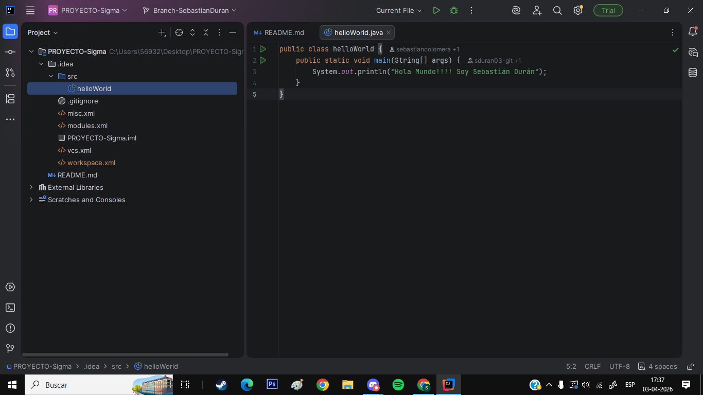
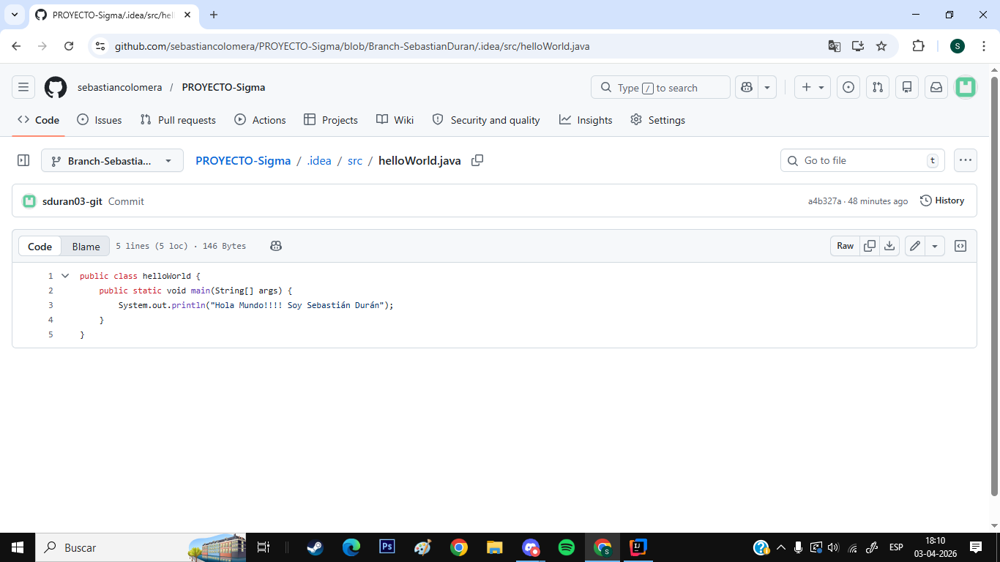
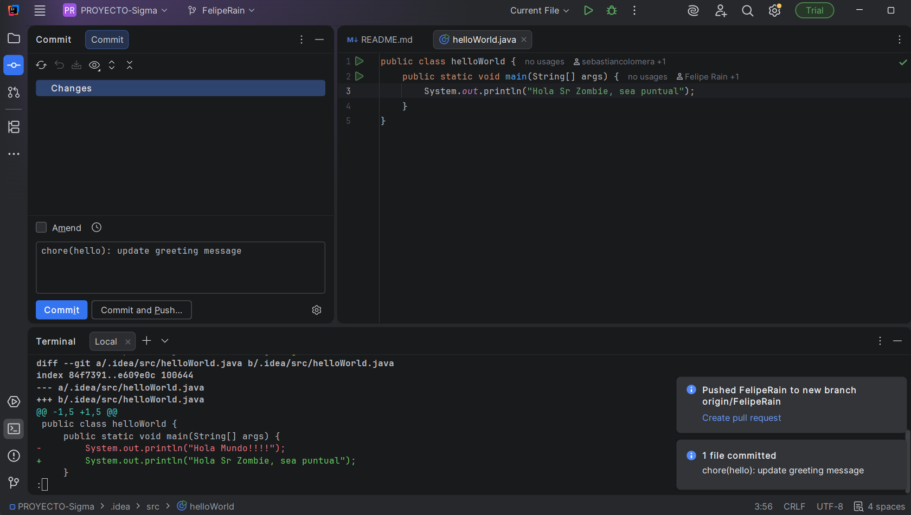
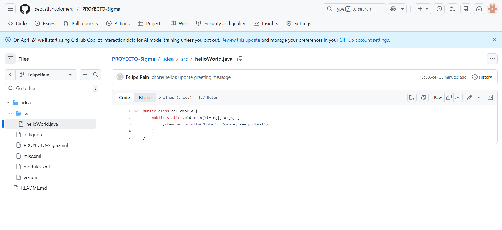
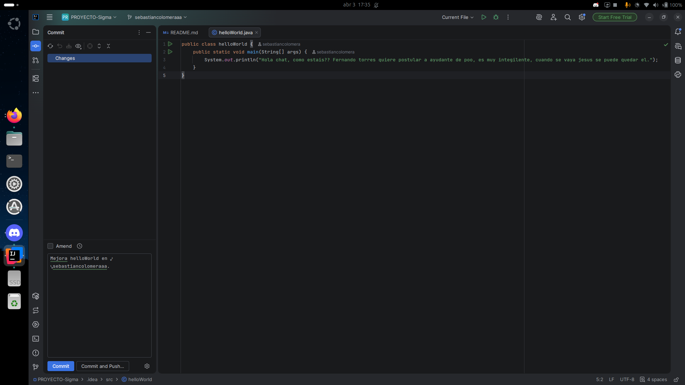
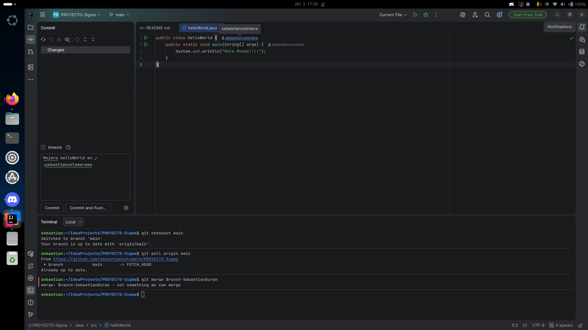
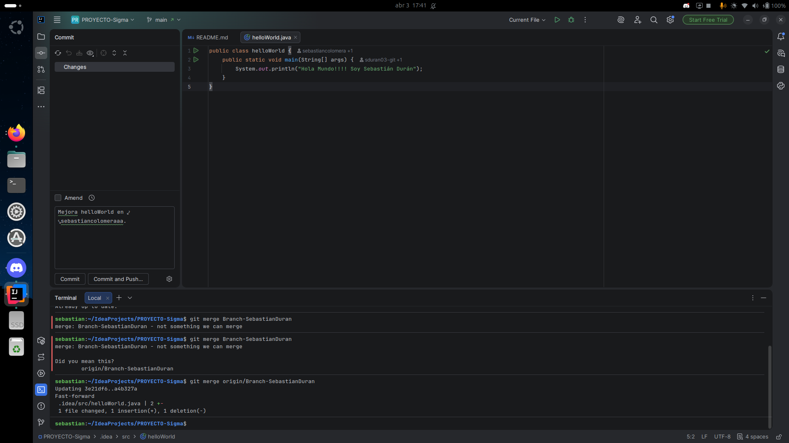
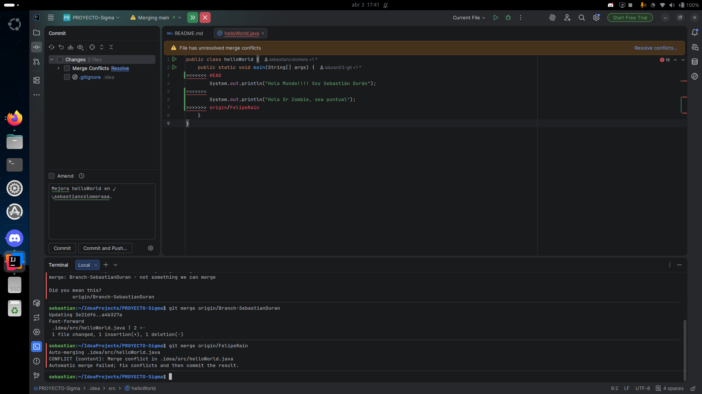
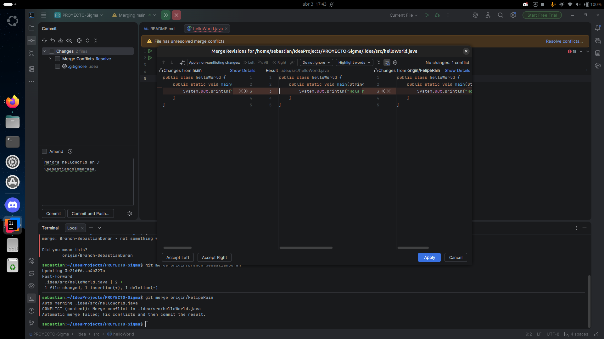
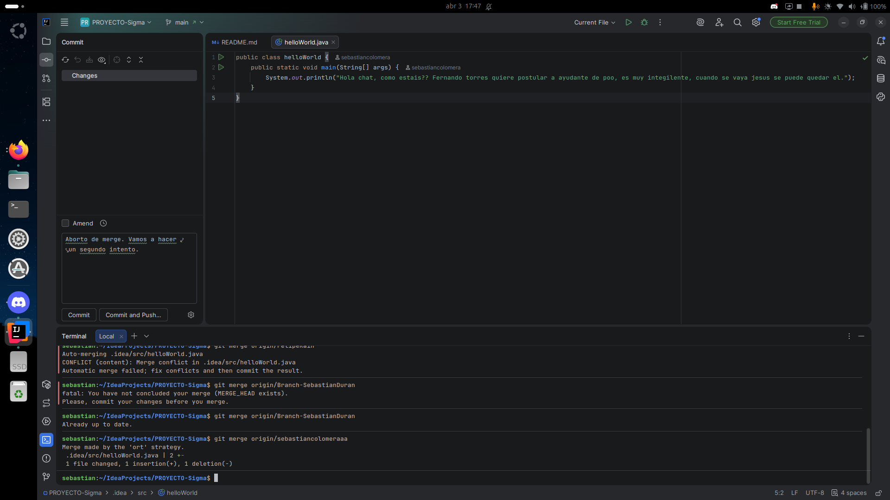

# LAB02-GIT-HUB(COLABORATIVO)

INTEGRANTES:

1) Sebastián Durán
2) Felipe Rain
3) Sebastián Colomera

ACTIVIDADES Y CONCLUSIONES:

Desarrollamos un codigo de helloWorld, creamos un main, luego desglosamos ese main en branches y hicimos cambios, luego en la fusión selecciionamos el botón "resolve conflicts" y esto ocasionó borrar los cambios hechos en 2 branches, por lo que no se vieron incorporadas en la fusion final. En conclusión, aprendimos que hace el "resolve conflicts", los merge, nos equivocamos y nos sentimos realizados con esta actividad, muchas gracias.

### Evidencias del Trabajo
Acá dejamos evidencia del momento en que resolvimos el Merge Conflict:

